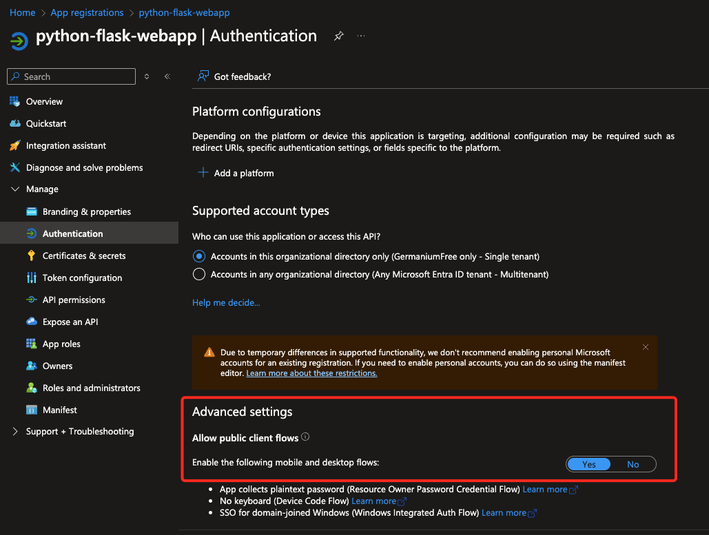
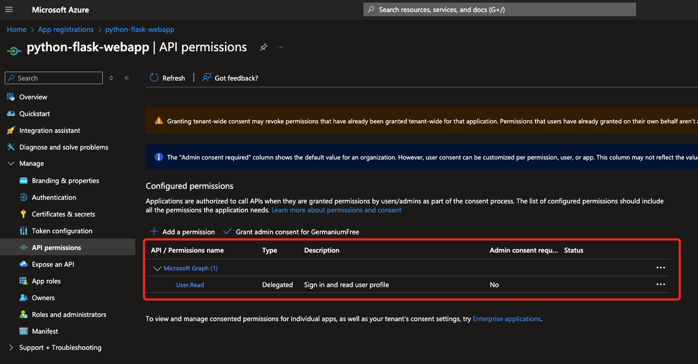

# Query Azure Graph API

The is a simple example of a web app querying the Azure Resource Graph API and asking information about the authenticated user.
The sript allow you either to pick the user uset previously from a persistent cache or initae a new login.

## Virtual environment
pyenv local 3.10.13
python3 -m venv .venv
source .venv/bin/activate
pip install -r requirements.txt
pip install --upgrade pip

## App registration

The code from this repository uses an instance of the `PublicClientApplication` class and performs authentication and authorization functions in Single Page Applications to obtain JWT tokens.

### Public client flows

Public applications are essentially applications that run on devices or desktop machines, or even a single page web application.

They do not require Redirect URI or in other words a web address that the user's browser is sent to after they have authenticated with an identity provider.



### API permissions

Let the application fetch information about the logged user from Microsoft Graph, in particular grant permission for User.Read



## Environment variables

Create a copy of the `.env-template` file with the name of `.env` and fill in values of the variables from App registration > Manage > Certificates & secrets
```
cp .env-template .env
```
